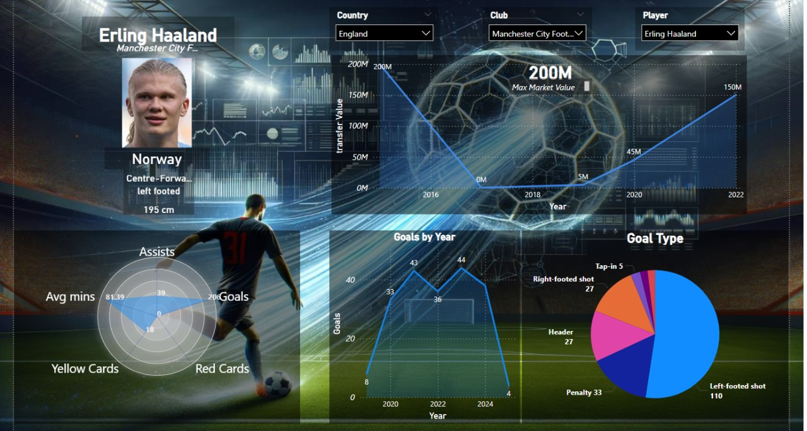

# ⚽ Football Transfer Market Data Pipeline & Dashboard
Performed EDA, data transformation, and dashboard reporting on football transfer market data. Gained insights into player stats, competitions, and club performance using Python and Power BI.

---

## 📊 Overview

This project delivers an **end-to-end data solution** for football market data — from data extraction and transformation to visualization and insight generation. It helps track **player transfers**, analyze **match events**, and measure **club performance** through a clean and interactive dashboard.

---

## 🔁 Data Pipeline

1. **📥 Ingestion**  
   - Raw data sources (CSV formats) were obtained from Kaggle.
     

2. **🧪 Exploratory Data Analysis (EDA)**  
   - Conducted in Python using **Pandas**, **Seaborn**, and **Matplotlib**.  
   - Identified trends such as most valuable transfers, top spending clubs, etc.

3. **🏗️ Dimensional Modeling**  
   - Designed a Galaxy schema with several Fact Tables

4. **🔄 ETL Pipeline**  
   - Built using **Pandas** to clean, join, and reshape raw data  
   - Transformed data saved as structured tables ready for analytics

5. **📊 Dashboard**  
   - Interactive dashboard built in **Power BI** showcasing:
     - Competitions Stats
     - Player Stats
     - Club-level performance metrics

---

## 🖼️ Sample Dashboard Preview

> 📌 *Visuals include transfer amounts, player positions, club analysis, timeline-based insights.*

     
     

---

## ⚙️ Technologies Used

| Purpose              | Tools                        |
|----------------------|------------------------------|
| EDA & ETL            | Python, Pandas, Seaborn      |
| Storage              | CSV  |
| Visualization        | Power BI                     |
| Dashboard Export     | `.pbix`, PNG                  |

